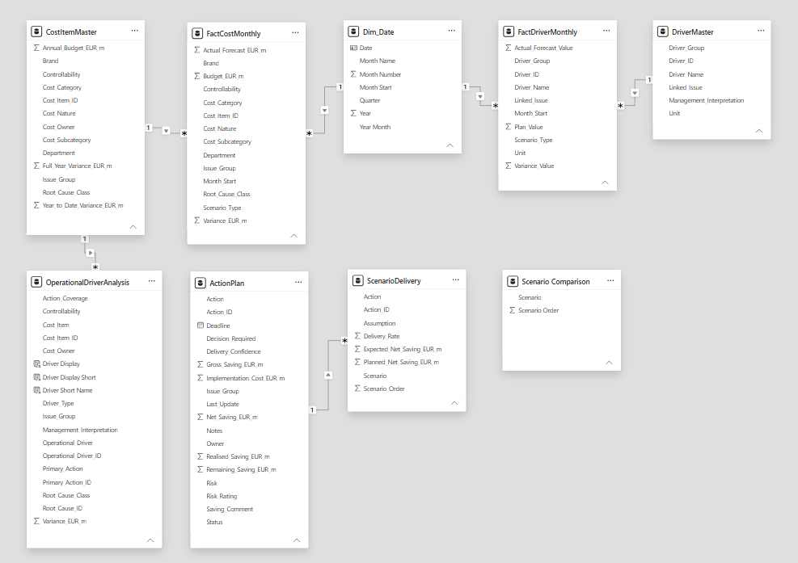
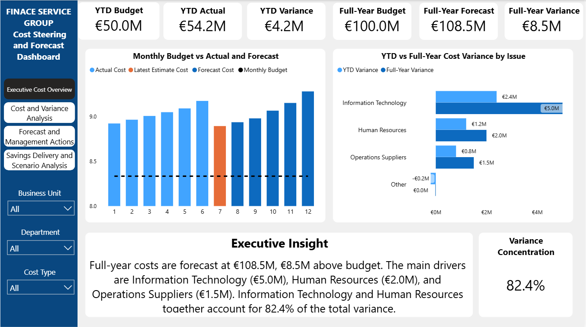
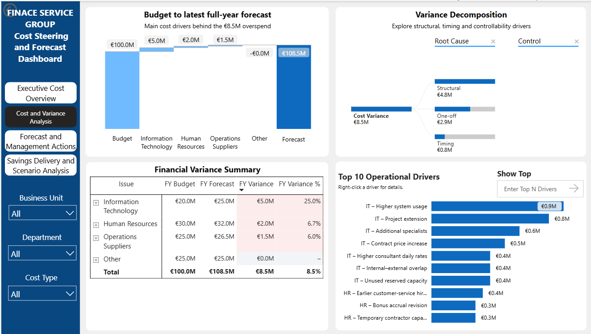
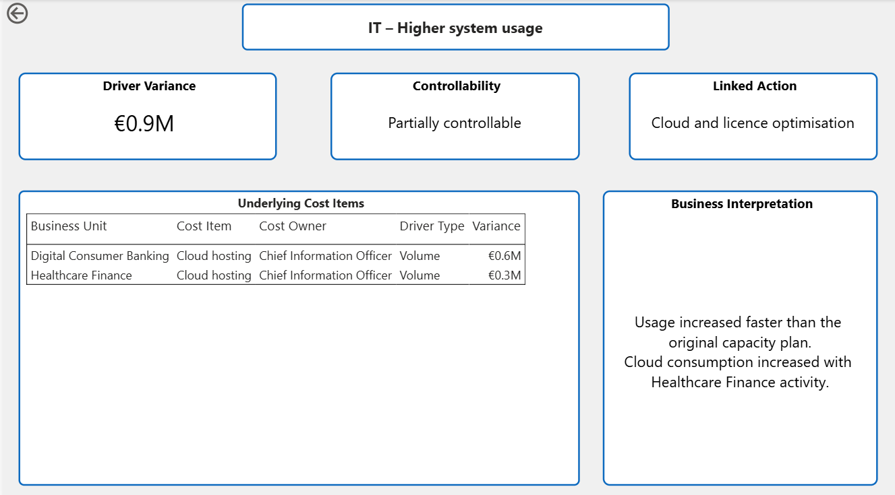
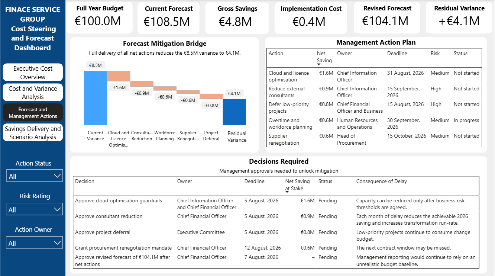
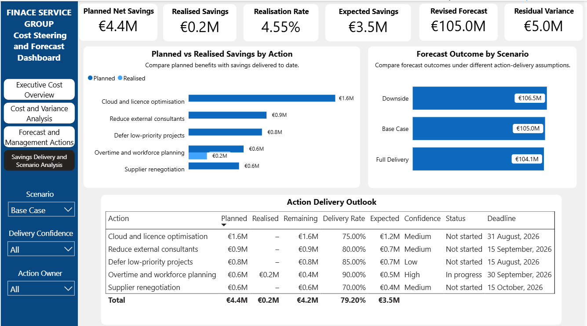

# Financial Services Cost Steering and Forecast Dashboard

> **Disclaimer:** This is an independent portfolio case study built with a fully synthetic dataset. All company names, business units, financial figures, operational drivers, and management assumptions are fictional and created solely for demonstration purposes. This project is not affiliated with or endorsed by any real company or financial institution.

## Table of Contents

- [1. Project Overview](#1-project-overview)
- [2. Business Problem](#2-business-problem)
- [3. Report Audience](#3-report-audience)
- [4. Dataset and Data Model](#4-dataset-and-data-model)
  - [4.1 Dataset](#41-dataset)
  - [4.2 Data Model](#42-data-model)
  - [4.3 Core Measures](#43-core-measures)
  - [4.4 Finance Control Checks](#44-finance-control-checks)
- [5. Dashboard Design](#5-dashboard-design)
  - [5.1 Management Question Framework](#51-management-question-framework)
  - [5.2 Dashboard Navigation](#52-dashboard-navigation)
- [6. Dashboard Insights](#6-dashboard-insights)
  - [6.1 Executive Cost Overview](#61-executive-cost-overview)
  - [6.2 Cost and Variance Analysis](#62-cost-and-variance-analysis)
  - [6.3 Forecast and Management Actions](#63-forecast-and-management-actions)
  - [6.4 Savings Delivery and Scenario Analysis](#64-savings-delivery-and-scenario-analysis)
- [7. Executive Summary](#7-executive-summary)
- [8. Business Recommendations](#8-business-recommendations)
  - [8.1 Focus on the largest structural cost drivers](#81-focus-on-the-largest-structural-cost-drivers)
  - [8.2 Separate recurring, one-off, and timing effects](#82-separate-recurring-one-off-and-timing-effects)
  - [8.3 Convert approved actions into measurable delivery](#83-convert-approved-actions-into-measurable-delivery)
  - [8.4 Use scenario-based forecasting](#84-use-scenario-based-forecasting)
  - [8.5 Strengthen Finance Business Partner governance](#85-strengthen-finance-business-partner-governance)
- [9. Final Conclusion](#9-final-conclusion)

---

## 1. Project Overview

This project presents a synthetic Finance Business Partner case study for a fictional European financial services group.

The Power BI dashboard was developed to analyse cost performance, explain the operational causes of budget variance, evaluate mitigation actions, and assess full-year forecast outcomes under different savings-delivery scenarios.

The reporting currency is EUR. The analysis covers year-to-date performance and the full-year 2026 forecast.

The dashboard focuses on four management areas:

- Current cost performance against budget
- Structural, timing, and one-off drivers behind the forecast variance
- Management actions required to reduce the expected overspend
- Savings delivery and scenario-based forecast outcomes

The project demonstrates practical skills in:

- Cost controlling and variance analysis
- Forecasting and scenario modelling
- Management reporting
- Savings tracking and action governance
- Power BI data modelling and DAX
- Finance Business Partner communication

---

## 2. Business Problem

The company has a full-year cost budget of **€100.0M**, while the current forecast has increased to **€108.5M**. This creates an adverse full-year variance of **€8.5M**.

Year-to-date costs are also above plan:

| Metric | Amount |
|---|---:|
| YTD Budget | €50.0M |
| YTD Actual | €54.2M |
| YTD Adverse Variance | €4.2M |
| FY Budget | €100.0M |
| Current FY Forecast | €108.5M |
| FY Adverse Variance | €8.5M |

Management therefore needs to understand:

- Which departments and operational drivers are causing the overspend
- Whether the variance is structural, timing-related, or one-off
- Which cost areas are controllable
- Which mitigation actions should be approved and prioritised
- How much saving has already been realised
- How different delivery assumptions affect the year-end forecast

The key business question is:

> **How can management reduce the forecast cost overspend while maintaining operational capacity and ensuring that planned savings are realistically delivered?**

---

## 3. Report Audience

This dashboard is designed for:

- Chief Financial Officer
- Finance Business Partners
- Cost Centre Owners
- Department Heads
- Procurement Management
- Operations Management

The report supports decisions related to:

- Cost planning and forecasting
- Variance review and root-cause analysis
- Cost-owner accountability
- Mitigation action approval
- Savings delivery monitoring
- Full-year forecast updates

---

## 4. Dataset and Data Model

### 4.1 Dataset

The project uses a fully synthetic financial dataset created for portfolio purposes.

The dataset includes:

- Monthly budget, actual, and forecast costs
- Cost centres, departments, business units, and cost categories
- Operational variance drivers
- Root-cause and controllability classifications
- Management mitigation actions
- Gross savings, implementation costs, and net savings
- Realised and remaining savings
- Scenario-specific delivery assumptions
- Action owners, status, confidence, deadlines, and management interpretation

The model separates financial transactions, master data, operational drivers, action plans, and scenario assumptions so that each business question can be analysed at the appropriate level of detail.

### 4.2 Data Model

The Power BI model uses a structured relationship design:

- `Dim_Date` supports monthly and year-to-date analysis.
- `CostItemMaster` contains cost item attributes and links to the monthly cost fact table.
- `FactCostMonthly` stores budget, actual, and forecast values.
- `OperationalDriverAnalysis` explains the operational causes behind cost variance.
- `ActionPlan` stores mitigation actions, ownership, status, savings, and deadlines.
- `ScenarioDelivery` stores delivery rates and expected savings by action and scenario.
- `Scenario Comparison` is a disconnected table used to compare all scenarios in one visual without being filtered by the scenario slicer.

The central relationships include:

- `CostItemMaster[Cost_Item_ID]` → `FactCostMonthly[Cost_Item_ID]`
- `CostItemMaster[Cost_Item_ID]` → `OperationalDriverAnalysis[Cost_Item_ID]`
- `ActionPlan[Action_ID]` → `ScenarioDelivery[Action_ID]`

The model follows a single-direction filtering approach to keep scenario calculations and action-level analysis predictable.

### 4.3 Core Measures

The dashboard uses DAX measures to calculate:

- YTD Budget
- YTD Actual
- YTD Variance
- Full-Year Budget
- Full-Year Forecast
- Full-Year Variance
- Gross Action Savings
- Implementation Cost
- Net Action Savings
- Realised Savings
- Remaining Savings
- Realisation Rate
- Expected Savings by Scenario
- Revised Forecast
- Residual Variance
- Weighted Delivery Rate

The scenario logic connects expected savings with the selected delivery assumption:

> **Revised Forecast = Current Full-Year Forecast − Expected Savings**

> **Residual Variance = Revised Forecast − Full-Year Budget**

### 4.4 Finance Control Checks

Before building the dashboard, finance logic checks were applied to ensure that the model is financially consistent and explainable.

| Control Check | Logic | Purpose | Result |
|---|---|---|---|
| YTD Variance Check | YTD Actual − YTD Budget = YTD Variance | Validate year-to-date variance | Passed |
| FY Variance Check | FY Forecast − FY Budget = FY Variance | Validate full-year variance | Passed |
| Variance Driver Check | Sum of departmental variances = Total FY Variance | Reconcile the variance bridge | Passed |
| Operational Driver Check | Sum of operational drivers = Departmental variance | Reconcile root causes to financial variance | Passed |
| Net Savings Check | Gross Savings − Implementation Cost = Net Savings | Validate action economics | Passed |
| Remaining Savings Check | Net Savings − Realised Savings = Remaining Savings | Validate delivery tracking | Passed |
| Expected Savings Check | Planned Net Savings × Delivery Rate = Expected Savings | Validate scenario assumptions | Passed |
| Revised Forecast Check | Current Forecast − Expected Savings = Revised Forecast | Reconcile forecast mitigation | Passed |
| Residual Variance Check | Revised Forecast − FY Budget = Residual Variance | Validate the remaining budget gap | Passed |

---

## 5. Dashboard Design

The dashboard follows a decision-oriented flow. It starts with the overall cost position, moves into the underlying causes, connects those causes to management actions, and then evaluates whether the actions are likely to improve the full-year forecast.

### 5.1 Management Question Framework

Each page answers a specific management question:

| Page | Management Question |
|---|---|
| Executive Cost Overview | Where is the company currently expected to finish against budget? |
| Cost and Variance Analysis | What is causing the overspend, and which drivers are controllable? |
| Forecast and Management Actions | Which actions should management approve, and what is their financial impact? |
| Savings Delivery and Scenario Analysis | How much saving is being delivered, and how does delivery affect the forecast? |

### 5.2 Dashboard Navigation

The report contains four main pages:

1. Executive Cost Overview
2. Cost and Variance Analysis
3. Forecast and Management Actions
4. Savings Delivery and Scenario Analysis

An additional hidden drill-through page provides operational-driver detail, including:

- Underlying cost items
- Business unit context
- Controllability
- Linked action
- Management interpretation

Users can right-click an operational driver to open the detailed view.

---

## 6. Dashboard Insights

This dashboard is structured from high-level performance monitoring to detailed management action and forecast delivery. It does not only report that costs are above budget; it explains why the variance exists, what management can do, and how realistically the proposed actions are expected to reduce the overspend.

### 6.1 Executive Cost Overview

The Executive Cost Overview page answers the question:

> **Where is the company currently expected to finish against the full-year cost budget?**

The company has a YTD budget of **€50.0M** and YTD actual costs of **€54.2M**, resulting in an adverse variance of **€4.2M**.

The full-year forecast is **€108.5M** against a budget of **€100.0M**, creating an adverse full-year variance of **€8.5M**.

The variance is highly concentrated:

| Cost Area | FY Adverse Variance |
|---|---:|
| Information Technology | €5.0M |
| Human Resources | €2.0M |
| Operations Suppliers | €1.5M |
| Total | €8.5M |

Information Technology and Human Resources together account for approximately **82.4%** of the total forecast variance. This concentration is important because management does not need to apply broad cost cutting across the organisation. The immediate priority should be to focus on the limited number of cost areas responsible for most of the overspend.

The page also distinguishes the variance by nature:

- Structural costs
- One-off costs
- Timing differences

This helps management understand whether the forecast issue requires a permanent cost-base intervention, a temporary correction, or improved phasing and accrual discipline.

### 6.2 Cost and Variance Analysis

The Cost and Variance Analysis page answers the question:

> **What is causing the overspend, and which drivers are controllable?**

The full-year variance bridge shows how the forecast moves from the **€100.0M budget** to the **€108.5M current forecast**:

- Information Technology: **+€5.0M**
- Human Resources: **+€2.0M**
- Operations Suppliers: **+€1.5M**

The decomposition analysis separates the variance into structural, one-off, and timing-related causes. Structural costs represent the largest component, which indicates that a significant part of the overspend may continue into the future unless management changes the underlying run-rate.

The main operational drivers include:

- Higher cloud usage
- Project extensions
- Additional specialist support
- Contract price increases
- Higher consultant usage
- Internal-to-external resource substitution
- Unused reserved capacity
- Earlier customer or business activity
- Bonus accrual adjustments
- Temporary contractors

The operational-driver chart allows management to rank the largest causes and drill through to detailed supporting information.

#### Operational Driver Drill-through

Users can right-click an operational driver to review its underlying cost items, controllability, linked management action, and business interpretation.

The drill-through page connects each driver to:

- Underlying cost items
- Business context
- Controllability
- Primary mitigation action
- Management interpretation

This moves the analysis beyond a financial statement of variance. It gives cost owners a direct link between the reported overspend and the operational decisions that created it.

### 6.3 Forecast and Management Actions

The Forecast and Management Actions page answers the question:

> **Which actions should management approve, and what is their expected financial impact?**

Management has identified **€4.8M** of gross savings opportunities. After **€0.4M** of implementation cost, the proposed actions provide **€4.4M** of net savings.

| Management Action | Net Saving |
|---|---:|
| Cloud and licence optimisation | €1.60M |
| Reduce external consultants | €0.85M |
| Defer low-priority projects | €0.80M |
| Overtime and workforce planning | €0.60M |
| Supplier renegotiation | €0.55M |
| Total Net Savings | €4.40M |

Under full delivery, the actions would reduce the forecast from **€108.5M** to **€104.1M**. However, the company would still remain **€4.1M above budget**.

This is an important management conclusion: the current action plan materially improves the forecast, but it does not fully eliminate the underlying cost gap.

The page therefore separates actions into two management views:

1. **Action Plan**  
   Tracks saving value, ownership, status, risk, and deadline.

2. **Decisions Required**  
   Highlights actions requiring management approval or intervention.

The largest approval-dependent actions are cloud and licence optimisation, consultant reduction, project deferral, and supplier renegotiation. Together, these represent a significant share of the available savings and should be prioritised based on financial value, implementation timing, and operational risk.

### 6.4 Savings Delivery and Scenario Analysis

The Savings Delivery and Scenario Analysis page answers the question:

> **How much saving is being delivered, and how does delivery affect the full-year forecast?**

The company has identified **€4.4M** of planned net savings, but only **€0.2M** has been realised to date. This represents a realisation rate of approximately **4.55%**.

The realised amount is currently linked to overtime and workforce planning. The remaining actions have not yet produced confirmed financial savings.

This creates an execution risk: management may approve actions and include them in the forecast before the savings are operationally delivered and financially evidenced.

Three delivery scenarios are used:

| Scenario | Expected Savings | Revised Forecast | Residual Variance |
|---|---:|---:|---:|
| Downside | €2.05M | €106.45M | €6.45M |
| Base Case | €3.49M | €105.02M | €5.02M |
| Full Delivery | €4.40M | €104.10M | €4.10M |

Under the Base Case scenario, expected savings are approximately **€3.5M**, reducing the full-year forecast to approximately **€105.0M**. The remaining adverse variance is approximately **€5.0M**.

The Action Delivery Outlook table combines:

- Planned net saving
- Realised saving
- Remaining saving
- Scenario delivery rate
- Expected saving
- Delivery confidence
- Action status
- Deadline

This provides a more realistic management view than reporting planned savings alone. It distinguishes the total opportunity from the amount already realised and the amount reasonably expected under the selected scenario.

---

## 7. Executive Summary

The company is forecasting full-year costs of **€108.5M** against a budget of **€100.0M**, resulting in an adverse variance of **€8.5M**.

The overspend is mainly concentrated in Information Technology, Human Resources, and Operations Suppliers. Information Technology and Human Resources account for approximately **82.4%** of the total variance, allowing management to focus on a limited number of high-impact cost areas.

Operational analysis shows that the variance is driven by cloud usage, project extensions, specialist and consultant support, overtime, temporary contractors, and supplier price increases. A large part of the overspend is structural, which means it may continue into future periods unless management changes the underlying run-rate.

Management has identified **€4.4M** of net savings opportunities. Under full delivery, the actions would reduce the forecast to **€104.1M**, but the company would still remain **€4.1M above budget**.

Under the more realistic Base Case scenario, approximately **€3.5M** of savings is expected, reducing the forecast to approximately **€105.0M** and leaving a residual adverse variance of approximately **€5.0M**.

Only **€0.2M** of savings has been realised to date. The main management challenge is therefore not only identifying cost actions, but converting approved actions into measurable financial results.

The overall priority should be to:

- Address the largest structural cost drivers
- Protect operationally critical spending
- Strengthen action ownership and delivery governance
- Update the forecast based on realistic evidence
- Track realised savings against an agreed baseline

---

## 8. Business Recommendations

### 8.1 Focus on the largest structural cost drivers

Management should prioritise Information Technology and Human Resources because these areas generate most of the forecast overspend.

For Information Technology, the focus should be on:

- Cloud consumption and reserved capacity
- Unused or overlapping software licences
- Extended projects
- External consultants
- Contract price increases

For Human Resources, the focus should be on:

- Overtime
- Temporary contractors
- Workforce planning
- Bonus and payroll accrual accuracy

The objective should not be broad cost cutting. Management should remove inefficient or avoidable spending while protecting costs that support regulatory obligations, customer service, system stability, and critical business operations.

### 8.2 Separate recurring, one-off, and timing effects

Finance should classify every material variance as:

- Structural or recurring
- One-off
- Timing-related

Structural variances should be reflected in the forward-looking run-rate and future budgets.

One-off costs should be isolated so they do not distort the recurring cost base.

Timing variances should be validated through purchase orders, accruals, invoice timing, and project milestones.

This classification improves forecast quality and prevents management from treating temporary underspending or delayed invoices as permanent savings.

### 8.3 Convert approved actions into measurable delivery

Each management action should have:

- A named owner
- A clear financial baseline
- A confirmed implementation date
- Monthly milestones
- Evidence of operational completion
- Evidence of financial realisation
- A defined escalation path

A saving should only be classified as realised when it can be demonstrated through a lower run-rate, contract reduction, invoice reduction, headcount or overtime change, licence removal, or another measurable financial outcome.

Approval alone should not be treated as delivery.

### 8.4 Use scenario-based forecasting

Management should avoid using a single optimistic saving assumption.

The forecast should include at least three scenarios:

- **Downside:** Delays, partial implementation, or lower-than-expected financial impact
- **Base Case:** Most actions delivered with realistic execution risk
- **Full Delivery:** All planned actions delivered in full and on time

The Base Case should be used as the primary management forecast unless there is sufficient evidence to support Full Delivery.

The scenario should be updated monthly based on:

- Action status
- Realised savings
- Delivery confidence
- Missed milestones
- Contract or supplier confirmation
- Cost-owner evidence

### 8.5 Strengthen Finance Business Partner governance

Finance Business Partners should challenge cost owners on both financial and operational assumptions.

A monthly cost review should cover:

1. Actual versus budget performance
2. Latest full-year forecast
3. Structural, one-off, and timing drivers
4. Action status and delivery confidence
5. Realised versus planned savings
6. Risks, decisions, and required escalation

Cost owners should explain not only what changed, but also:

- Why the variance occurred
- Whether it will continue
- What action is being taken
- When the action will affect the financial result
- What evidence supports the expected saving

This governance process would improve forecast traceability, cost accountability, and management decision-making.

---

## 9. Final Conclusion

This dashboard supports a decision-oriented cost management process.

It does not only report that costs are above budget. It explains:

- Where the variance is concentrated
- Which operational drivers created it
- Whether the variance is structural, one-off, or timing-related
- Which actions management can take
- How much saving has been realised
- How different delivery assumptions affect the forecast

The company has a material cost challenge, with a current full-year forecast **€8.5M above budget**. The proposed actions can reduce the gap, but even full delivery does not return the business to budget.

The main conclusion is therefore that management needs both immediate mitigation and stronger long-term cost discipline.

The short-term priority is to deliver the current action plan and validate realised savings. The longer-term priority is to address the structural cost base, improve forecast quality, and strengthen accountability between Finance and cost owners.

This project demonstrates how a Finance Business Partner can move beyond reporting historical numbers and support management through root-cause analysis, forward-looking forecasting, action tracking, and scenario-based decision-making.
